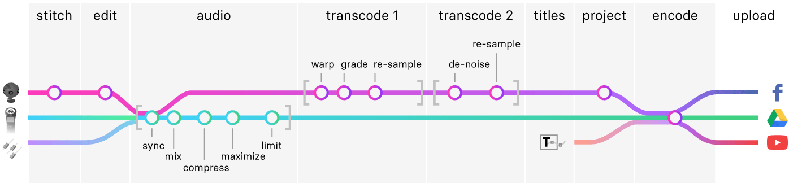

# My 360 Video Pipeline

360 videography is an exciting but new field, with little information available for advanced users. I hope to help other aspiring 360 videographers avoid the trial and error I experienced when building a video processing pipeline along with a render farm to handle large projects.

I got my first 360 camera to record a [vlog about making a replica of the exoskeleton from Elysium](https://hackaday.io/project/19830-elysium-max-exoskeleton), but quickly realized the medium's potential and set out to capture as many experiences as possible. One of these projects was a 45-minute show of my favorite local band. Bringing this project to completion required more planning and equipment than I expected. The information below helped me to bridge this gap.

## Overview

## Equipment

For every project I use the [Insta 360 Pro I](https://www.insta360.com/product/insta360-pro) with an [external SSD](https://www.amazon.com/gp/product/B073H552FJ/ref=ppx_yo_dt_b_asin_title_o02__o00_s00) and [battery](https://www.amazon.com/gp/product/B016BJCRUO/ref=oh_aui_search_asin_title). I leave the stock battery and a memory card inside the camera in case the external ones fail.

Since the onboard mic cannot handle the loudness and dynamic range of a real performance, I supplement the sound with an [external stereo sound recorder](https://www.amazon.com/gp/product/B07B4KFQW7/ref=oh_aui_search_asin_title) and the audio from the venue board recorded on to a USB drive.

## Pre-flight

Checklist of the equipment the day before and 45 minutes before filming:

* Fully charge camera, external sound recorder, and light batteries.
* Format camera and sound recorder media and have a few minutes of test footage recorded to ensure integrity.
* Check that camera has redundant storage and power.
* Pack camera, sound recorder, lights, monopod, and a USB stick formatted with `FAT32` (for recording audio from the venue board) along with accessories.

## Setup

Checklist to setup at the venue:

* Unpack the camera and set it up on its monopod.
* Unpack and setup the audio capture: set level, activate limiter, plug in headphones and start recording. Avoid using a leveler because it turns up the ambient noise when the performance gets quiet.
* Turn on the camera and configure settings as described in the next section, selecting external SSD as the media for recording.
* Work with the artist and the venue to find an optimal position for the camera so that it looks unobtrusive on the stage yet captures a scene that makes the viewer feel like they are a part of the performance. Avoid placing the camera where it might cast a shadow on the performer(s).
* Rotate the camera on its monopod to place the stitch lines that occur in-between lenses in unimportant areas that artists on stage will not be crossing often or standing nearby.
* Unpack and setup the lights.
* Work with artist and venue to find an optimal position for the lights.
* Start the camera recording.
* Verify levels on the external sound recorder during soundcheck, just before the show.

### Camera Settings

I use the following settings for Insta 360 Pro in Video mode:

|Setting|Value|
|-------|-----|
|**General**||
|Mode|Normal|
|Content type|360&deg; Pano|
|Real-time Stitching|off|
|Save origins from six lens|on|
|Single lens resolution|8K@30F|
|Flat color mode|on|
|Audio gain|-24 dB|
|**Exposure**||
|Mode|Manual|
|ISO|640|
|Shutter|1/40s|
|WB|Auto|
|**Property**||
|Brightness|0|
|Saturation|64|
|Sharpness|3|
|Contrast|64|

## Stitch Settings

I use the [Insta360 Stitcher](https://www.insta360.com/download/insta360-pro) with the following settings:

|Setting|Value|
|-------|-----|
|**Stitch**||
|Content Type|Monoscopic|
|Stitching Mode|New Optical Flow|
|Sampling Type|Slow|
|Blender Type|Auto|
|Use original offset|off|
|Use Default Circle Position|on|
|Gyroscopic Stabilization|off|
|Use Hardware Decoding|6|
|Use Hardware Encoding|off|
|Software encoding speed|Highest Quality (Slowest)|
|Use nadir logo|off|
|**Reference Frame**|(default setting)|
|**Cut Video**||
|From|(select 10 seconds before the artist performs)|
|To|(select 15 seconds after the artist performs)|
|**Output**||
|Resolution|8K|
|Output Format|MP4(H.264/H.265)|
|Codec Type|h264 codec|
|Profile|High|
|Bitrate|350 Mbps|
|Frame Rate|30 fps|
|Audio Type|Normal|
|Output Directory|(select your fastest drive that can fit at least 500 GB)|
|Output File Name|(projectname-stitch.mp4)|

After starting the batch stitching process I switch tabs to "Pro 2 File Manager" in order to continue the stitching but hide the preview image. Leaving the preview up crashes the stitcher.

## Editing

I use Adobe Premiere Pro because I also need Photoshop and Illustrator; it's more cost efficient to use everything from Creative Cloud.

* Create a new Premiere project.
* Import stitched footage and place into `stitch` bin.
* Create a new sequence from this footage.
* Clip the footage to the exact beginning of the performance, and leave a few seconds after the performance to capture applause and the performer(s) thanking the audience.

I never cut in the middle when recording performances, unless some footage is missing or it's a reel for Instagram - see **Encoding Projected Video** section for more information.

## Mixing and Mastering Audio

I think that the audio of the performance should be as enjoyable as the video and that's why I work on the sound immediately after editing:

* Import audio from the external recorder into the `audio` bin and call it `ambient`.
* Import audio from the board into the `audio` bin and call it `board`.
* Place imported audio tracks into the `stitch` sequence.
* Sync imported audio tracks to audio from the camera's onboard mic by using the Premiere sync audio feature. If that doesn't work do it manually. See [Synchronize clips in the Timeline panel](https://helpx.adobe.com/premiere-pro/using/synchronizing-audio-video-merge-clips.html#Merge%20clips%20in%20the%20Project%20panel).
* Mute the camera audio track.
* Mix the external audio sources.
* Apply fade automation to the beginning and end of the video by using Easing curves, and add any necessary cross-fades between audio sources.
* Apply multi-band compressors if necessary to repair a mix with a bad spectrum balance.
* Apply a loudness maximizer if necessary, and choose a setting to maximize left/right channels independently to ensure both are balanced in volume.
* Apply a brickwall limiter to the entire audio track at `-4 dB`. The AAC audio codec that will be used for the final video works best when the audio does not peak too close to `0 dB`.
* Render audio for the entire sequence and import back into the project, also placing into the `audio` bin as `render`.

See [Premiere Pro audio plug-ins](https://helpx.adobe.com/premiere-pro/using/audio-effects-transitions.html) reference for more information.

## Transcoding

I transcode the footage twice, downscaling each time to average the "noise" pixels because this lowers the noise floor on the image and makes it look sharper without accentuating noise like a sharpening algorithm would, or blurring like a de-noising algorithm would. I also apply different plug-ins on each pass.

I output both passes to PNG sequences. Using an uncompressed format like BMP may save up to 60% of time on rendering each pass including the final encode, if you have have several TB of space available. For each transcoding or encoding operation, input and output files should not be on the same drive to eliminate I/O bottleneck. Outputting each frame as a separate file will let you restart the transcoding process without loosing processed frames.

## Transcoding - First Pass

In this pass I perform color grading, rotate the camera, and re-sample the result from 8K to 5.2K.

### Color Grading

When using the camera settings in the previous section, advanced color grading is not required unless the Contrast is reduced to a lower value. A slight increase in Vibrance is enough in most cases.

I shoot in flat color mode with neutral settings to retain detail in colors and shadows. If a higher contrast or saturation are applied when shooting, pixel values in each channel are limited by chopping off highs and lows, which cannot be recovered. When this information is retained, applying a curve during color grading lets you re-distribute shadows and highlights and apply your own limiting to cut off values that contain more noise and retain values with detail.

I use the [Lumetri Color plug-in](https://helpx.adobe.com/premiere-pro/using/color-workflows.html) for color grading and toggle the following filters in different combinations to determine if they are needed:

* **Exposure**: This can be pushed to increase the richness of shadows, but it would require more de-noising, which blurs details.
* **Contrast**: This can be used along with Curves to tune the overall contrast. It adds an S-curve over the entire spectrum with the sharpness of the "S" controlled with this slider.
* **Shadows**: Controls the amplitude of shadow frequencies in the image. This adds a curve with a dip or a peak on shadows.
* **Vibrance**: I usually increase this to around 16 to enhance colored lights. Spot-check your footage for any places where this might blow out colored highlights. I don't use this setting for scenes without intense colored lights due to its "compress and apply makeup gain" effect that pulls out highly visible, animated noise.
* **White balance**: A proper white balance often ruins the mood established by colored lighting. Only apply this if the main lights in the scene are tungsten or daylight balanced.
* **Curve**: This is the master color grading curve. I don't mess with curves for each channel because that's a surgical equivalent to adjusting the white balance. When color grading flat color footage, the Master curve will resemble an "S" shape that re-maps the flat color distribution back into realistic colors. This lets you choose how much contrast you want to bring back and how you want to distribute shadows and highlights.

### Warping

If I want to modify the initial view, the one that appears before the screen is first rotated I use the **VR Rotate Sphere** plug-in included with Premiere as part of the first transcoding pass. This plug-in warps the video by re-mapping pixels across the 360 sphere. Warping should normally be done in the Stitching phase to save time, but the Insta 360 Stitcher doesn't allow specifying precise values in degrees.

The view should only be panned and never pitched or rolled unless you have to correct for a slanted tripod. Applying pitch will break the panning motion because most viewers would expect to turn side-to-side to look left and right, but pitched footage will turn up and down at the same time. This ruins the experience of looking around in the 360 video.

### Re-sampling

The result of color grading and warping is rendered to a 5.2K PNG sequence:

|Setting|Value|
|-------|-----|
|Format|PNG|
|Width|5120|
|Height|2560|
|Export As Sequence|on|
|Render at Maximum Depth|on|
|Include Alpha Channel|off|
|Use Maximum Render Quality|on|

I use 5.2K instead of 6K (another popular resolution for 360 video) because consumer cameras like [GoPro Fusion](https://shop.gopro.com/cameras/fusion/CHDHZ-103-master.html), [YI360](https://www.yitechnology.com/yi-360-vr-camera), and [Insta360 One X](https://www.insta360.com/product/insta360-onex/) support at least 5.2K, making it possible to pipe in footage from secondary cameras at this stage and morph from one to another.

## Transcoding - Second Pass

This pass applies a de-noising algorithm and reduces the resolution down to 4K.

### De-noising

I use either [Red Giant Denoiser III](https://www.redgiant.com/products/magic-bullet-denoiser), which has a built-in re-sharpening pass, or a combination of [Neat Video Reduce Noise](https://www.neatvideo.com/) and [Boris FX VR Sharpen](https://borisfx.com/effects/continuum-vr-sharpen-1/).

When using the **Denoiser III** plug-in, I often turn off the re-sharpening pass and set other settings lower to reduce noise on light halos and make everything look smoother without increasing noise. If the lighting at the performance was bright enough I can usually get away with a small amount of re-sharpening.

When using the **Neat Video** plug-in, I select an area with the most noise and use the automatic profile analysis to let the plug-in decide what to do. The results are always great, although this plug-in often takes more time to process than Denoiser III. When possible, I apply a re-sharpening pass with **Boris FX VR Sharpen**.

### Re-sampling

The result of de-noising is re-sampled to a 4K PNG sequence:

|Setting|Value|
|-------|-----|
|Format|PNG|
|Width|4096|
|Height|2048|
|Export As Sequence|on|
|Render at Maximum Depth|on|
|Include Alpha Channel|off|
|Use Maximum Render Quality|on|

## Animating Titles

I personalize each video by including custom, animated titles that I create with Blender or Adobe After Effects.

### 2D Titles

AfterEffects comes with a [VR Comp Editor plug-in](https://www.premiumbeat.com/blog/vr-comp-editor-360-video/), which projects a portion of the video sphere onto a 1920x1080 rectangle, lets you add some text and animated effects, then re-projects it back onto the video sphere, and finally blends it in with the original footage.

I have a few simple rules for animating 2D titles:
* Stay within the square safe area displayed in Premiere VR mode. This will fit the cropping area even when the video is shown in a Facebook post, which is the most restrictive.
* If possible, find the font the artist is already using. Otherwise, use carefully picked fonts that enhance their branding. To save time, I regularly search [FontFabric](https://www.fontfabric.com/), [MyFonts](https://www.myfonts.com/), and [Creative Market](https://creativemarket.com/) for quality fonts.
* Use cubic easing curves with extreme "ease" toward the end of the motion range to create a feeling of luxury.
* Prefer a small range of movement combined with a large range of fading to accentuate the extreme easing.
* Use vector masking effects, like drawing a rectangular or custom-shaped mask around each letter and animating each mask to have the letters appear in sequence.
* Use blending effects, by duplicating the text several times and setting a different blending mode on each copy.
* Use raster masking effects, like taking a portion of the footage from a random time and place in the video, masking it by the shape of the text, and scrolling it through the text with a blending mode that produces a nice effect. I often create several layers of this, scrolling different parts of the footage and various time ranges through the text, each with a different blending mode.
* Lastly, if I can find any existing branding elements for the artist I extract them from the background in Photoshop and bring them into AfterEffects to add animation and blending effects.

I worked on 2D titles for the following videos:
* [Soriah - Star Theater](https://www.facebook.com/vnovytskyy/videos/10212159917706323/)
* [David Yow - Star Theater](https://www.facebook.com/vnovytskyy/videos/10212136093870742/)
* [TaelorFX - House of Shadows](https://www.facebook.com/vnovytskyy/videos/10211345263140468/)

### 3D Titles

To render 3D titles with Blender, I use the Cycles rendering engine which supports outputting to the same equirectangular format as VR video:

|Setting|Value|
|-------|-----|
|Engine|Cycles|
|Camera Lens|Panoramic|
|Camera Lens Type|Equirectangular|
|Resolution X|4096|
|Resolution Y|2048|
|Frame Rate|30 fps|
|Samples|512|
|World Surface|Emission|
|World Surface Color|Environment Texture|
|World Surface Color Image|(Choose a frame from the video)|

With the above World settings any 3D objects placed in the scene will be lit by lights and ambient reflections in the video. That way I don't have to setup virtual lights and match them to the lighting in the video, and any shiny objects will actually reflect the scene in the video.

I worked on 3D titles for the following videos:
* [Dead Animal Assembly Plant - New Year show](https://www.facebook.com/vnovytskyy/videos/10212143426534054/)
* [Dead Animal Assembly Plant - Halloween show](https://www.facebook.com/vnovytskyy/videos/10211691765842819/)
* [Apophis Theory - Paris Theater show](https://www.facebook.com/vnovytskyy/videos/10210737464745888/)
* [TaelorFX - RAW artist showcase](https://www.facebook.com/vnovytskyy/videos/10211836572822903/)
* [Adventuredness - Intro](https://www.facebook.com/vnovytskyy/videos/10212068685265569/)

## Encoding 360 Video

I import both transcoding passes into project bins labeled `transcode 5.2K` and `transcode 4K` and create the `final` sequence at the root of the project from the second transcode. Then I add the previously rendered audio and layer the titles (imported into `titles` bin as `titles-360`) over the first 7-10 seconds of the video. I also add any additional fading and effects to blend the titles into the video and fade it out at the end.

|Setting|Value|
|-------|-----|
|Format|H.264|
|Width|4096|
|Height|2048|
|Frame Rate|30|
|Encoding Performance|Software Encoding|
|Encoding Profile|High|
|Encoding Level|5.1|
|Bitrate Encoding|VBR, 2 pass|
|Target Bitrate|45 Mbps|
|Maximum Bitrate|45 Mbps|
|Render at Maximum Depth|on|
|Video is VR|on|
|Frame Layout|Monoscopic|
|Horizontal Field of View|360|
|Vertical Field of View|180|
|Use Maximum Render Quality|off|

## Encoding Projected Video

360 videos cannot be posted on Instagram or displayed in older browsers. To render a projected view of the 360 video, I import the transcoded 5.2K footage into AfterEffects, then add the audio rendered from Premiere, and the original 2D Edit from AfterEffects where the titles were animated.

If the titles were 3D, I duplicate the Blender file and change the camera back to a regular 2D camera, setting the output resolution to 1920x1080 and re-rendering.

I use the same VR Comp Editor plug-in to add a 2D Edit on the transcoded video and choose a better camera rotation if necessary, since viewers will no longer be able to rotate the camera.

The titles and rendered audio go into the 2D Edit comp, then I can re-create any effects necessary to blend titles into the video and to fade the video out. Lastly I apply the same de-noiser plug-in(s) as I used in the second transcoding pass, but this time to the 2D composition. I use the Facebook HD preset to encode the projected video:

|Setting|Value|
|-------|-----|
|Format|H.264|
|Preset|Facebook 1080p Full HD|
|Width|1920|
|Height|1080|
|Frame Rate|30|
|Aspect|Square Pixels|
|Encoding Performance|Software Encoding|
|Encoding Profile|High|
|Encoding Level|4.2|
|Bitrate Encoding|VBR, 2 pass|
|Target Bitrate|12 Mbps|
|Maximum Bitrate|16 Mbps|
|Render at Maximum Depth|on|
|Use Maximum Render Quality|off|

## Uploading

This section provides a quick reference for sharing 360 videos.

### Facebook

See [Facebook 360 video requirements](https://www.facebook.com/help/828417127257368).

|Setting|Value|
|-------|-----|
|Format|MP4|
|Video Codec|H.264|
|Max Resolution|5K (5120x2560)|
|Frame Rates|30|
|Audio Codec|AAC|
|Video Bitrate (4K)|45 Mbps|
|Audio Bitrate (Stereo)|128 kbps|
|Recommended Length|Up to 30 minutes|

### YouTube

See [YouTube 360 video requirements](https://support.google.com/youtube/answer/6178631?hl=en).

|Setting|Value|
|-------|-----|
|Format|MP4|
|Video Codec|H.264|
|Frame Rates|24, 25, 30, 48, 50, 60|
|Audio Codec|AAC-LC|
|Video Bitrate (4K)|35-45 Mbps|
|Audio Bitrate (Stereo)|128 Kbps, 384 kbps|
|Recommended Length|Up to 30 minutes|

### Google Drive

See [Google Drive free storage limits](https://support.google.com/a/answer/172541?hl=en). You can store up to `15 GB` for free, which is about `50 minutes` of 4K 360 video. See also [steps for sharing files publically](https://www.appypie.com/faqs/how-can-i-make-my-google-drive-document-public).

## Building a Render Farm

Working with 8K footage and using de-noising plug-ins requires a computer that balances overall performance with storage capacity. I used these components:

|Spec|Choice|
|----|------|
|CPU|[Intel Core i9-9980XE](https://www.amazon.com/Intel-i9-9980XE-Processor-Processors-999AD1/dp/B07JGCMQY8)|
|GPU|[NVIDIA Titan Xp](https://www.amazon.com/gp/product/B0757DSD6D)|
|Motherboard|[ASUS ROG Rampage VI Extreme Omega X299-II](https://www.amazon.com/ROG-Rampage-VI-Extreme-Motherboard/dp/B07MBJ6N9D)|
|Memory|2x [G.SKILL Trident Z 16GB 288-Pin RGB DDR4 4266](https://www.amazon.com/G-SKILL-Trident-Royal-288-Pin-F4-4266C19D-16GTRG/dp/B07LD5S9V2)|
|HD1 (Transcoding)|[HighPoint rSSD7101B 2TB NVMe RAID Drive](https://www.amazon.com/gp/product/B077SNV26F) (only one fits on the motherboard)|
|HD2 (Transcoding)|[Samsung 970 EVO 2TB - NVMe PCIe M.2 2280 SSD](https://www.amazon.com/Samsung-970-EVO-2TB-MZ-V7E2T0BW/dp/B07C8Y31G1)|
|HD3 (Cache)|[Samsung 970 EVO 2TB - NVMe PCIe M.2 2280 SSD](https://www.amazon.com/Samsung-970-EVO-2TB-MZ-V7E2T0BW/dp/B07C8Y31G1)|
|HD4 (System)|[Samsung 860 PRO V-NAND 1TB SSD](https://www.amazon.com/Samsung-V-NAND-MZ-76P1T0BW-Solid-State/dp/B078211KCN)|
|Power Supply|[EVGA SuperNOVA TITANIUM 1600W](https://www.amazon.com/gp/product/B00R33ZBQU)|
|CPU Cooler|[ARCTIC Liquid Freezer 240](https://www.amazon.com/ARCTIC-Liquid-Freezer-240-Performance/dp/B013WAY9UQ) (fans swapped for Noctua below)|
|Case Fans|[Noctua NF-S12B Redux Quiet Case Fan](https://www.quietpcusa.com/Noctua-NF-S12B-redux-700-120mm-Quiet-Case-Fan--P1065.aspx)|
|Case|[Fractal Design ATX Silent Mid Tower Case](https://www.newegg.com/Product/Product.aspx?Item=N82E16811352092)|

Most of the transcoding work is done on a single core. Multi-core performance accelerates only minor tasks like color grading and blending. One exception is CPU rendering in Blender, which will use all available cores. Due to these factors, the `CPU` was chosen to favor a high single-core clock speed over the number of cores.

`GPU` is used to render 3D Titles in Blender and does not affect the transcoding performance. If you don't need this capability, GPU can be downgraded. If you render complex 3D effects in high resolution, the GPU can be upgraded to [NVIDIA Titan Rtx](https://www.amazon.com/NVIDIA-Titan-RTX-Graphics-Card/dp/B07L8YGDL5) or [NVIDIA Quadro P6000](https://www.amazon.com/PNY-Quadro-P6000-Graphic-Card/dp/B01M0S2FKR).